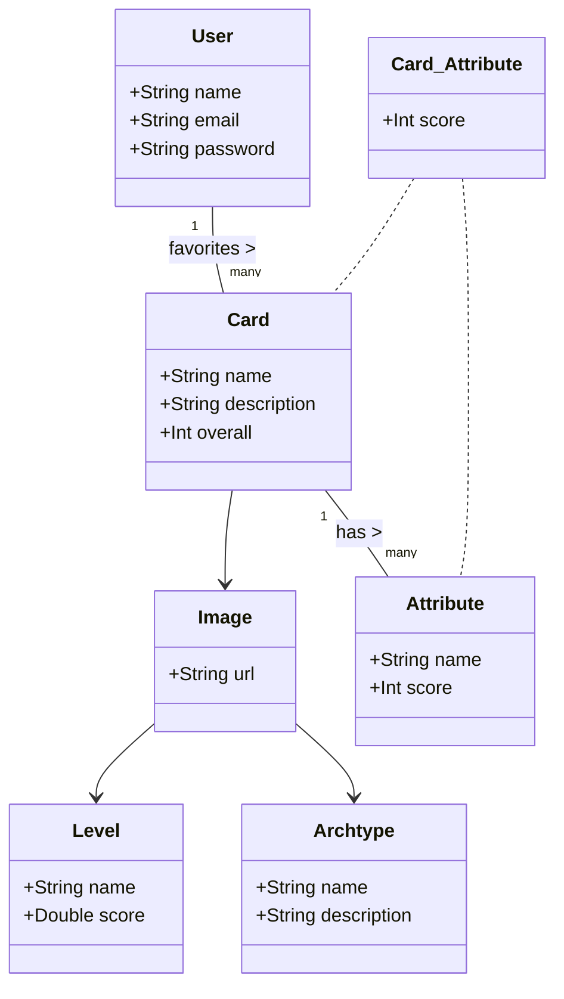

# Diagramas

## UML

```mermaid
classDiagram
    Image --> Level
    Image --> Archtype
    Card --> Image
    Card "1" -- "many" Attribute: has >
    User "1" -- "many" Card: favorites >
%% Association class for Card-Attribute
    class Card_Attribute {
        +Int score
    }
    Card_Attribute .. Card
    Card_Attribute .. Attribute

    class Image {
        +String url
    }

    class Level {
        +String name
        +Double score
    }

    class Archtype {
        +String name
        +String description
    }

    class Card {
        +String name
        +String description
        +Int overall
    }

    class Attribute {
        +String name
        +Int score
    }

    class User {
        +String name
        +String email
        +String password
    }
```

## Diagrama de sequência

Em breve